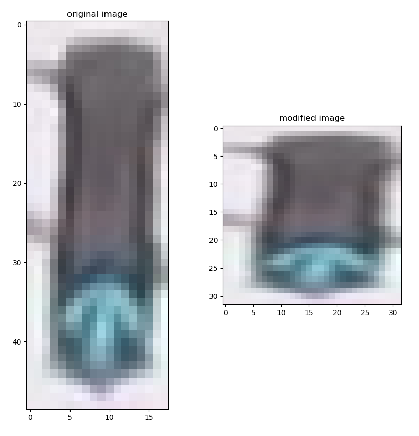
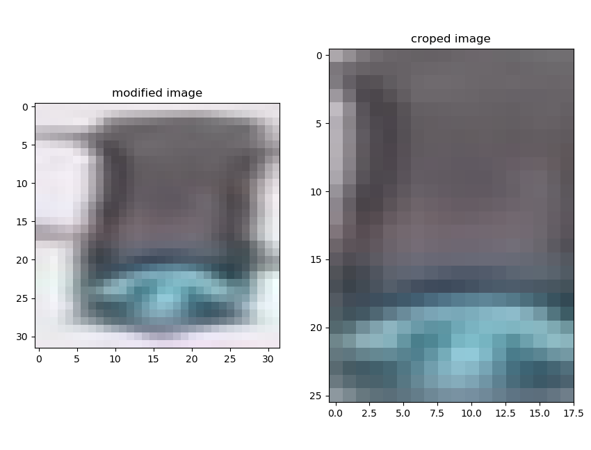
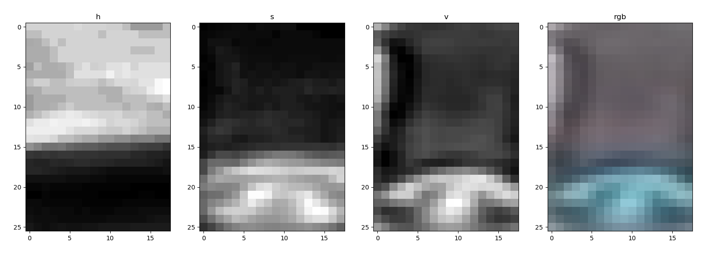
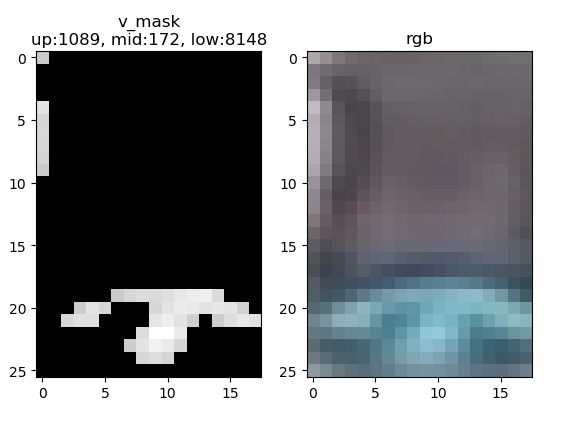

[TOC]

## 识别交通灯

## 预处理

### 1 加载库

~~~python
import cv2
import helpers # 用来加载图像
import numpy as np
import matplotlib.pyplot as plt
import matplotlib.image as mpimg
~~~


### 2 定义图像路径

~~~python
IMAGE_DIR_TRAING = "traffic_light_images/training/"
IMAGE_DIR_TEST ="traffic_light_images/test/"
~~~


### 3 加载数据集

~~~python
IMAGE_LIST = helpers.load_dataset(IMAGE_DIR_TRAINING)
TEST_IMAGE_LIST = helpers.load_dataset(IMAGE_DIR_TEST)
~~~


### 4 标准化图像的尺寸

把输入图像的尺寸统一转换成32x32。

~~~python
def standardize_input(image):
    standard_im = np.copy(image)
    standard_im = cv2.resize(standard_im, (32, 32))
    return standard_im

path = "F:/code/images/green.jpg"
img = mpimg.imread(path)
img_2 = standardize_input(img)
fig, (ax1, ax2) = plt.subplots(1, 2, figsize=(10, 10))
ax1.set_title("original image")
ax1.imshow(img)
ax2.set_title("modified image")
ax2.imshow(img_2)
plt.show()
~~~




### 5 转换标签

把红灯、绿灯、黄灯转换成独热标签。

~~~python
def one_hot_encode(label):
    one_hot_encode = []
    if label == "red":
        one_hot_encode = [1, 0, 0]
    elif label == "yellow":
        one_hot_encode = [0, 1, 0]
    else:
        one_hot_encode = [0, 0, 1]
    return one_hot_encode
~~~


### 6 标准化数据集

利用前面的函数，标准化数据集。

~~~python
def standardize(image_list):
    standard_list = []
    for item in image_list:
        image, label = item[0], item[1]
        standardized_im = standardize_input(image)
        one_hot_label = one_hot_encode(label)
        standard_list.append((standardized_im, one_hot_label))
    return standard_list

STANDARDIZED_LIST = standardize(IMAGE_LIST)
STANDARDIZED_TEST_LIST = standardize(TEST_IMAGE_LIST)
~~~


## 图像识别

### 1 获取hsv的亮度值

裁剪图像。

~~~python
image_crop = rgb_image[3:-3, 7:-7]
~~~



获取hsv值，观察哪个通道适合最容易用来识别

~~~python
def create_feature(rgb_image):
    # 裁剪图像，去掉背景的干扰
    image_crop = rgb_image[3:-3, 7:-7]   
    # 转换成hsv色彩空间
    hsv = cv2.cvtColor(image_crop, cv2.COLOR_RGB2HSV)
    # 提取hsv的3个通道的值
    h, s, v = hsv[:,:,0], hsv[:,:,1], hsv[:,:,2]
    return h, s, v

path = "F:/code/images/green.jpg"

img = mpimg.imread(path)
img = standardize_input(img)
fig, (ax1, ax2, ax3, ax4) = plt.subplots(1, 4)
h, s, v = create_feature(img)

ax1.set_title("h")
ax1.imshow(h, cmap="gray")

ax2.set_title("s")
ax2.imshow(s, cmap="gray")

ax3.set_title("v")
ax3.imshow(v, cmap="gray")

ax4.set_title("rgb")
ax4.imshow(img[3:-3, 7:-7])

plt.show()
~~~




从图中可以看出，亮度值v用来识别交通灯效果最好。观察数据集发现，红绿灯的形状都是竖排，并且依次是红灯，黄灯和绿灯。一个思路是，首先通过亮度值v判断哪个位置的灯点亮，再通过位置判断其颜色。

为了减少干扰，通过遮罩屏蔽亮度值低的像素。

~~~python
def create_feature(rgb_image):
    # 裁剪图像，去掉背景的干扰
    image_crop = rgb_image[3:-3, 7:-7]   
    # 转换成hsv色彩空间
    hsv = cv2.cvtColor(image_crop, cv2.COLOR_RGB2HSV)
    # 提取hsv的3个通道的值
    h, s, v = hsv[:,:,0], hsv[:,:,1], hsv[:,:,2]
    # 创建亮度遮罩，凸显亮着的灯
    lower = np.array(170)
    upper = np.array(255)
    mask = cv2.inRange(v, lower, upper)
    # 屏蔽亮度低的像素，亮度值不再阈值范围内的像素，涂成黑色
    hsv_mask = np.copy(hsv)
    hsv_mask[mask !=255] = [0, 0, 0]

    # 提取屏蔽处理后的图像的hsv的值
    h_mask = hsv_mask[:,:,0]
    s_mask = hsv_mask[:,:,1]
    v_mask = hsv_mask[:,:,2]
    return h_mask, s_mask, v_mask 


path = "F:/code/images/green.jpg"

img = mpimg.imread(path)
img = standardize_input(img)
fig, (ax1, ax2) = plt.subplots(1, 2)
h_mask, s_mask, v_mask = create_feature(img)

ax1.set_title("v_mask")
ax1.imshow(v_mask, cmap="gray")

ax2.set_title("rgb")
ax2.imshow(img[3:-3, 7:-7])

plt.show()
~~~


计算图像亮度值v。把图像分成上、中、下三个部分，分别计算它们的亮度值。

~~~python
def create_feature(rgb_image):
    # 裁剪图像，去掉背景的干扰
    image_crop = rgb_image[3:-3, 7:-7]   
    # 转换成hsv色彩空间
    hsv = cv2.cvtColor(image_crop, cv2.COLOR_RGB2HSV)
    # 提取hsv的3个通道的值
    h, s, v = hsv[:,:,0], hsv[:,:,1], hsv[:,:,2]
    # 创建亮度遮罩，凸显亮着的灯
    lower = np.array(170)
    upper = np.array(255)
    mask = cv2.inRange(v, lower, upper)
    # 屏蔽亮度低的像素，亮度值不再阈值范围内的像素，涂成黑色
    hsv_mask = np.copy(hsv)
    hsv_mask[mask !=255] = [0, 0, 0]

    # 提取屏蔽处理后的图像的hsv的值
    h_mask = hsv_mask[:,:,0]
    s_mask = hsv_mask[:,:,1]
    v_mask = hsv_mask[:,:,2]

    # 把图像分成up、mid、low3部分
    # 并获得各部分的亮度总和
    up = np.sum(v_mask[0:9])
    mid = np.sum(v_mask[9:18])
    low = np.sum(v_mask[18:])
    return h_mask, s_mask, v_mask, up, mid, low


path = "F:/code/images/green.jpg"

img = mpimg.imread(path)
img = standardize_input(img)
fig, (ax1, ax2) = plt.subplots(1, 2)
h_mask, s_mask, v_mask, up, mid, low = create_feature(img)

ax1.set_title("v_mask\nup:{}, mid:{}, low:{}".format(up, mid, low))
ax1.imshow(v_mask, cmap="gray")

ax2.set_title("rgb")
ax2.imshow(img[3:-3, 7:-7])

plt.show()
~~~





### 2 分类器

通过up、mid和low的值，来判断灯的颜色。最简单的方法是，输出三者中值最大的那一个。

~~~python
def estimate_label(rgb_image):
    up, mid, low, h_mask = create_feature(rgb_image)
	if up > mid and up > low:
    	predicted_label = [1, 0, 0]	
	elif mid > up and mid > low:
    	predicted_label = [0, 1, 0]
	elif low > mid and low > up:
    	predicted_label = [1, 0, 0]
	else:
    	predicted_label = [1, 0, 0]
    return predicted_label
~~~

但是经过测试发现，这种方法准确率低，而且可能把红灯识别成绿灯。

优化的方法是，考虑亮度值的组合，并且考虑权重。设置权重的方法请见第四部分。

```python
def estimate_label(rgb_image):
    up, mid, low, h_mask = create_feature(rgb_image)
    i = 1.8
    j = 0.7
    k = 0.5
    if up > (mid + low) * i:
        predicted_label = [1, 0, 0]
    elif mid > (up + low) * j:
        predicted_label = [0, 1, 0]
    elif low > (up + mid) * k:
        predicted_label = [0, 0, 1]
    # 不能把红灯识别成绿灯，所以对于其他图像，一律识别成红灯。
    else:
        predicted_label = [1, 0, 0]
    return predicted_label
```


### 3 计算准确率

计算准确率，跟踪识别错误的图像，方便观察、优化。

~~~python
def get_misclassified_images(test_images):
    # 跟踪识别错误的图像
    misclassified_images_labels = []
    for image in test_images:
        im = image[0]
        true_label = image[1]
        # 检测是否为独热编码（one-hot encode)
        assert(len(true_label) == 3), "The true_label is not the expected length (3)."
        predicted_label = estimate_label(im)
        assert(len(predicted_label) == 3), "The predicted_label is not the expected length (3)."
        # 比较预测标签和正确标签，判断是否预测正确
        # 跟踪不正确的图像及其两个标签
        if (predicted_label != true_label):
            misclassified_images_labels.append((im, predicted_label, true_label))
    return misclassified_images_labels

# 输出结果
# 获得所有预测错误的标签
MISCLASSIFIED = get_misclassified_images(STANDARDIZED_TEST_LIST)

# 数据集中数据的总数
total = len(STANDARDIZED_TEST_LIST)

# 正确率
num_correct = total - len(MISCLASSIFIED)
accuracy = num_correct/total

print('Accuracy: ' + str(accuracy))
print("Number of misclassified images = " + str(len(MISCLASSIFIED)) +' out of '+ str(total))
~~~


### 4 设置权重

第二部分设置的权重 i = 1.8, j = 0.7, k = 0.5, 如果人工尝试会很麻烦，可以仿照“机器学习”的方法，写一段代码让计算机自己尝试，输出准确率最高，并且没有把红灯识别成绿灯的权重。

~~~python
# 训练参数i，j，k
def train():
    num = []
    for i in np.arange(0.5, 2, 0.1):
        for j in np.arange(0.5, 2, 0.1):
            for k in np.arange(0.5, 2, 0.1):
                num.append((i, j, k))
    return num

# 跟踪识别错误的图片的索引
def collect_error_image(STANDARDIZED_LIST):
    error_image_num = float("inf")
    best_i, best_j, best_k = None, None, None
    for each in train():
        i, j, k = each
        error = []
        # 跟踪图像索引
        n = 0
        for each_image in STANDARDIZED_LIST:
            image = each_image[0]
            label = each_image[1]
            predicted_label = estimate_label(image, i, j, k)
            # 如果把红色识别成绿灯，跳过本次循环
            if label == [1, 0, 0] and predicted_label == [0, 0, 1]:
                continue
            # 如果没有把红灯识别成绿灯，对于预测错了的图像，记录该图像的索引值n
            if predicted_label != label:
                error.append((n, label, predicted_label)) 
            n += 1
        if len(error) < error_image_num:
            error_image_num = len(error)
            best_i, best_j, best_k = i, j, k
            print("i:", best_i, "j:", best_j, "k:", best_k, "error image num:", error_image_num)
    print("number of error image:", error_image_num)
    print("{:.2f}%".format((1 - error_image_num/1187)*100))
    return best_i, best_j, best_k, error_image_num
~~~


完整代码请参考classifier.py

